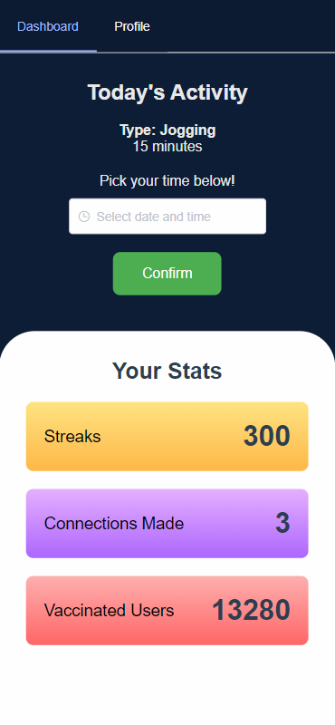
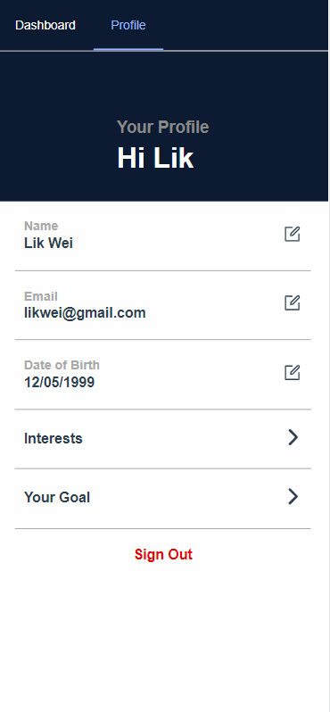
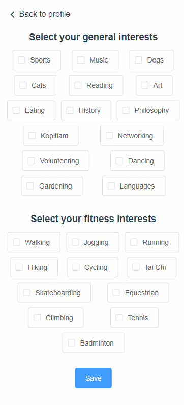

# Team Name: Pineapple🍍Casing (Team 13)

## Project: ActivateMY

Reactivating Malaysia safely by reintroducing an active & social lifestyle.

<p align="center">
  
  
  
</p>

## Inspiration

Our team had identified that a major downside as a result of the lockdown was that many people were forced into sedentary lifestyles. This is particularly not good for the health of our residents. Our team wanted to find a solution that tackles this while facilitating Malaysia's recovery through the NRP. We have also identified that people have been losing touch with their connections and there are lost opportunities to meet new people. We can't stray away from the fact that business have also been hit hard especially certain low-income businesses.

This is what our team wanted to address through our solution.

## What it does

The users of our app are vaccinated individuals. The aim of our app is to guide and motivate them into getting into an active lifestyle. It does this by taking into consideration the goals and interests of our users and keeping them accountable by recommended activities according to their interests in a progressive manner. It will start with lightweight activities and slowly progress towards what their goal was.

Moreover, it connect the individuals with other users around them with mutual interests and activities. This helps them be motivated and also serves to help make new connections since the pandemic took away this privilege from us. Hence, our users are encouraged to be social with like-minded folk.

Finally, it suggests places to the users after their physical activity to to go and cool down. This includes local businesses like kopitiams and mamaks that were hit badly due to COVID. Businesses are further encouraged to ensure safely within their premises through regular sanitisation and other measures and updating the cleanliness onto our app which can be seen by users. Places that follow better SOPs are likely to gain more visitors and hence promotes the following of SOPs in businesses. There is also a feature to add photographic evidence of SOPs to gain user confidence.

## How we built it

We built a responsive PWA that works on both mobile and desktop primarily using VueJS.

## Challenges we ran into

We ran into issues setting up MongoDB and our server code as our Backend developer's laptop died in between. We were short on manpower :') .

## Accomplishments that we're proud of

We implemented PWAs for the first time and used tools we haven't before. We have a working prototype and that makes us proud.

## What we learned

The tools used were pretty much new to everyone. We also learnt how we can save time and work more efficiently.

## What's next for ActivateMY

Support Malaysia in its recovery!

# Try it out!

## Project setup

```
npm install
```

### Compiles and hot-reloads for development

```
npm run serve
```

### Compiles and minifies for production

```
npm run build
```

### Lints and fixes files

```
npm run lint
```

### Customize configuration

See [Configuration Reference](https://cli.vuejs.org/config/).
